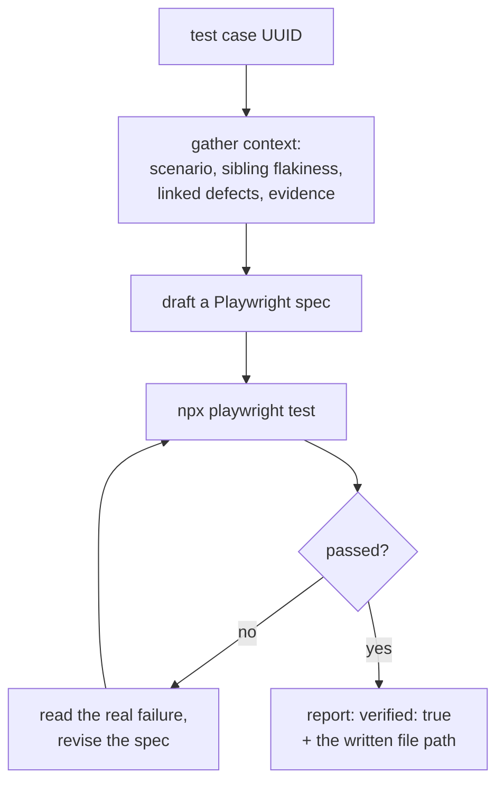

# Appliqation Scriptgen

**Drafts and verifies an enterprise-grade Playwright script for one test case — and never claims it passes without actually running it.**

Point it at a test case that has no canonical automation yet, and it investigates the surrounding context (scenario intent, sibling test flakiness, linked defects, prior execution evidence), writes a real Playwright spec into your repo, and iterates against a real `npx playwright test` run until it's genuinely green — not until the model *says* it's green.

## Why this exists

Most "AI writes your tests" tools generate a script and hope. This one is judged by a single rule: **`testRun.ok` is only ever `true` if a real, `execFile`-reported Playwright process exited 0, and that run happened *after* the most recent file write.** An earlier passing run that predates the latest edit doesn't count — that's a stale result, not a verification. If the generated script never actually ran, the exit code reflects that honestly, every time.

## How it works



The context-gathering and drafting *methodology* itself lives in Appliqation's own `appq:automate` MCP prompt — this repo is deliberately thin: it just gives that workflow two tool surfaces (read-only Appliqation context tools, and real filesystem + an allowlisted shell) and lets it do the work.

- **No appq write tool, no git operation.** This agent writes local files only — nothing is synced back to Appliqation and nothing is committed. [`appliqation-pr-raise`](https://github.com/appliqation/appliqation-pr-raise) handles turning the result into a real PR.
- **A hardcoded, non-negotiable shell allowlist.** `npm init/install -D`, `npx playwright install/--version/test`, `node --version`, `git status/diff` — nothing else can run, checked before execution, spawned via `execFile` with an explicit argv array (never a shell string).

## Quick start

```bash
npm install -g appliqation-scriptgen
```

Create a `.env` file (in whatever directory you'll run it from) with:

```
APPQ_API_KEY=your-appliqation-api-key
ANTHROPIC_API_KEY=your-anthropic-key   # or OPENAI_API_KEY — pick one
```

```bash
appliqation-scriptgen generate \
  --test-case-uuid <uuid> \
  --repo-path /path/to/your/checkout
```

Add `--environment <name>` if the target repo needs a fresh Playwright config bootstrapped (its `baseURL` context), `--role <name>` to authenticate as a specific role (otherwise inferred per-TC automatically), `--autotest-run-id <id>` to ground the draft in a prior [`appliqation-autotest`](https://github.com/appliqation/appliqation-autotest) run's real execution evidence, and `--json`/`--ci` for a structured summary + CI-friendly exit code.

## Configuration

Copy `.env.example` to `.env`. Requires `APPQ_API_KEY` and one of `ANTHROPIC_API_KEY`/`OPENAI_API_KEY`.

## Development

```bash
git clone https://github.com/appliqation/appliqation-scriptgen.git
cd appliqation-scriptgen
npm install
cp .env.example .env   # fill in APPQ_API_KEY and one LLM provider key
npm run dev -- generate --test-case-uuid <uuid> --repo-path <path>
npm run typecheck
npm test
```

See `CLAUDE.md` for a map of this repo if you're working in it with an AI coding assistant.

## License

MIT — see [LICENSE](./LICENSE).
